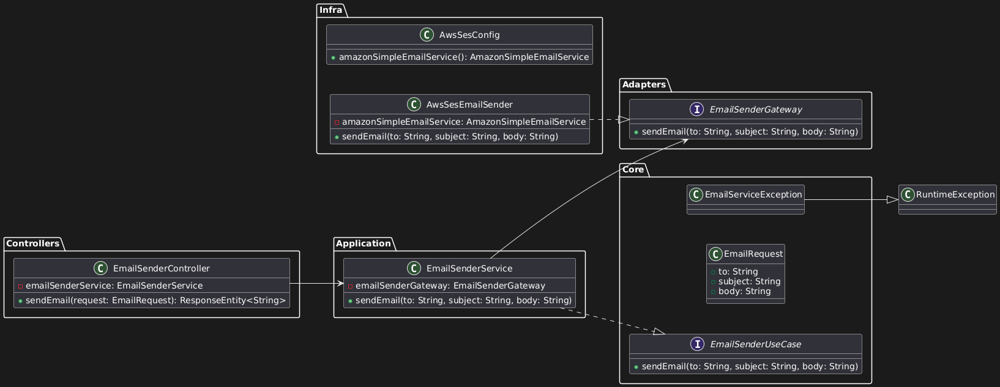

# 📬 _Email Service_ - Microsserviço em _Java Springboot_

**Versão 1.0.0**

O [README.md](docs/README.md) completo encontra-se em `docs/README.md`.

Este projeto é um microsserviço _backend_ de uma API Restfull desenvolvida utilizando _Java Spring Boot_ com conexão com o _Amazon Simple Email Service (SES)_ ou _Mailgun_ para envio de emails. Seguindos os conceitos da Arquitetura Limpa (_Clean Architecture_), permitindo flexibilidade para trocar o provedor de email.

Essa aplicação recebe um `JSON` por requisição `POST` com parâmetros para disparar um email e envia email usando um provedor de email.

Este sistema fornece uma abstração entre dois provedores de serviços de e-mail diferentes, se um dos serviços cair,o email é rapidamente enviado para outro provedor sem afetar os clientes.

---

## 📋 Funcionalidades

- Envio de emails utilizando o _Amazon SES_ ou _Mailgun_
- Estrutura modular baseada em Arquitetura Limpa (_Clean Architecture_).
- Suporte para múltiplos provedores de email (ex.: _SendGrid_, _Mailgun_, etc.).
- Configuração de credenciais via variáveis de ambiente.

---

## 🌐 API _Endpoints_

A API fornece os seguintes _endpoints_:

**POST SendEmail**

```markdown
POST /api/email/send –  Enviar um novo e-mail
```

```json
{
  "to": "example@example.com",
  "subject": "Assunto do Email",
  "body": "Body do email"
}
```

---

## 🛠️ Tecnologias Utilizadas

- [**_Java 24_**](https://jdk.java.net/24/)
- [**_Spring Boot_ 3.x**](https://start.spring.io/)
- [**_Amazon SES SDK_**](https://docs.aws.amazon.com/AWSJavaScriptSDK/latest/AWS/SES.html#constructor-property)
- [**_Mailgun_**](https://www.mailgun.com/)
- [**_Maven_**](https://maven.apache.org/download.cgi) (Adicionado durante a configuração no _SpringBoot_)
- **_Lombok_** (Adicionado durante a configuração no _SpringBoot_)

---

## 🚀 Como Executar o Projeto

### Pré-requisitos

- **_Java 24_** ou superior instalado. [Java 24 Download](https://jdk.java.net/24/).
- **_Maven_** instalado _ou_ uma IDE como [VSCode](https://code.visualstudio.com/) (com Extensões para _SpringBoot_) ou [IntelliJ IDEA](https://www.jetbrains.com/pt-br/idea/)
- Conta na **AWS** com o serviço _SES_ configurado.
- Configuração das variáveis de ambiente para as credenciais da AWS.

### Configuração das Variáveis de Ambiente

As variáveis de sistema necessárias são:

- `AWS_ACCESS_KEY_ID`: Chave de acesso da AWS.
- `AWS_SECRET_KEY`: Chave secreta da AWS.
- `AWS_REGION`: Região onde o serviço _SES_ está configurado (ex.: `us-east-1`).
- `EMAIL_SOURCE`: Endereço de email verificado no _SES_ para envio.

Preencha as variáveis de ambiente em um arquivo `.env` na raiz do projeto, você pode usar o arquivo `.env-sample` como exemplo e renomea-lo para `.env`.

```sh
# AWS Credentials
AWS_ACCESS_KEY_ID=
AWS_SECRET_KEY=
AWS_REGION=us-east-1
# Email Configuration
EMAIL_SOURCE=
```

Ou defina as variáveis de ambiente no seu sistema:

#### No Windows (PowerShell)

```powershell
$Env:AWS_ACCESS_KEY_ID = "sua_access_key_id"
$Env:AWS_SECRET_KEY = "sua_secret_key"
$Env:AWS_REGION = "us-east-1"
$Env:EMAIL_SOURCE = "seu_email_verificado@exemplo.com"
```

Se acaso quiser que elas tornem-se permanentes use:

```powershell
setx AWS_ACCESS_KEY_ID = "sua_access_key_id"
setx AWS_SECRET_KEY = "sua_secret_key"
sext AWS_REGION = "us-east-1"
sext EMAIL_SOURCE = "seu_email_verificado@exemplo.com"
```

#### No Linux/macOS

```bash
export AWS_ACCESS_KEY_ID="sua_access_key_id"
export AWS_SECRET_KEY="sua_secret_key"
export AWS_REGION="us-east-1"
export EMAIL_SOURCE="seu_email_verificado@exemplo.com"
```

### Executando a Aplicação

1. Clone o repositório:

   ```bash
   git clone https://github.com/seu-usuario/email-service.git
   cd email-service
   ```

2. Compile e execute o projeto com o Maven:

   ```bash
   mvn clean package
   java -jar target/email_service-0.0.1-SNAPSHOT.jar
   ```

---

## 📬 Testando o Envio de Email

Envie uma requisição `POST` para o endpoint `/api/v1/email/send` com o seguinte corpo:

```json
{
  "to": "destinatario@exemplo.com",
  "subject": "Teste de Email",
  "body": "Este é um email de teste enviado pelo microsserviço."
}
```

Exemplo de comando `curl`:

```bash
curl -X POST http://localhost:8080/api/v1/email/send \
-H "Content-Type: application/json" \
-d '{
  "to": "destinatario@exemplo.com",
  "subject": "Teste de Email",
  "body": "Este é um email de teste enviado pelo microsserviço."
}'
```

---

## 🧱 Arquitetura

O projeto segue o padrão _Clean Architecture_, com as seguintes camadas:

1. **Core**: Contém as regras de negócio e casos de uso.
2. **Application**: Implementa os casos de uso definidos no Core.
3. **Adapters**: Define interfaces para comunicação com serviços externos.
4. **Infra**: Implementa as interfaces dos Adapters, como o cliente AWS SES.
5. **Controllers**: Exposição de endpoints REST para interação com o sistema.

### Diagrama de Classes



Veja também o diagrama de classes feito em:

- [PlantUML](http://www.plantuml.com/plantuml/duml/hLD1pzem3BttLrZV2RI1Tja5JGY4gcbNglq0axfTHffaiJl66Fzz6LLfKUY97NheY_tytekpOS4WRMCoGvM0E0Yw_YPGwa1AjBCP7xNr6B01wqfYyl3nG-PH7R4cUDkvG6zmoG2q5GeLAeAyGMqAiYM5hqmxPBeL0Bm3ZkZjU2Pk1OK4RUltmEtXEoaPW8Chp_tVFBPUuwSCCdVSU_hH4ikTTU3gW37X21spfgG5XPzQKVvBaRyPlsQ3pQttHYlyXqUtG-FWj6lldIw0XgFFA7J2E3fFi5TZUT1OeXSAd5n7CXKk_tFk5ri57AUoFN51F1fx3mKR_ErieHjlQ1pw2hOJ9wyAVTIqSxRITMz_KiviFYqeiHyv9JXZAF34QWmLpxQZZs3SCMK-T8k_UdW6KUoUs3lBb5lHSlxK1R3kfQR4i5p-MJzvfrbwTLrbkhXFI1UBoSeaYQuuTRo9VsrZ_W80)

  - PNG: `docs/uml/diagrama_classes.png`
  - SVG: `docs/uml/diagrama_classes.svg`
  - Source: `docs/uml/diagrama_classes.wsd`

- [Mermaid](https://www.mermaidchart.com/play?utm_source=mermaid_live_editor&utm_medium=toggle#pako:eNqtVNFOwjAU_ZWGJ4juBxZCMuc0JATIhm99KdsFq1uHbVGR-O-2G7Pt2IgJ7qnrPfec03t7exykZQYDf-B5HmZpyTZ062OGkHyGAnzEIdt_ehnhr5hJKnO1FRWE5igBlgHHrM7LiRD3lGw5KTDLKIdU0pKhuxVmWDJSgNiRFFC4iCN01PT1V-XVhDXfk4CQCNAYLBvUjVCxCjSUpY8SySnb3iKxX78oHbOxLrND8zcyIt-dejG87UHIlpLhdw24Uk7MVrVEm0XPYfk7TSH6TGFXFerYztQSyrgpXbBczqZhsJou5g36rHonWnMmD0zwkUj4IAffTjjtNfArCq28unbvg-UqipNerydp4_Vqcb0yBqbzhzhw1YMPkYCwPFiFIgX5KllCi10Odot8FPRE_sd3211YTaBVlT5jwxG65M2id_oSLuareDGbXWqN8iB5medOgeDsmvkdV6-jKLweNN8ZO20-VpZKJiDSD8uh3cnaVbxXweJ8UBRIS43HlEngG3WyyaTjHbmIMZe_ouyYI8_rJtXw88vUQv_S_428D241o5Xh9Lr7WdEZ7RJiNvj-AQAwA_E)
  - Source: `docs/uml/diagrama_classes.nmd`

---

## 📝 TODO

- **Adicionar suporte a múltiplos provedores de email**:

  - [x] Implementar integração com provedores como _SendGrid_, _Mailgun_ e _SparkPost_.
  - [x] Criar uma lógica de fallback para alternar automaticamente entre provedores caso um deles falhe.
  - [x] Garantir que o serviço possa ser transferido rapidamente para outro provedor sem afetar os clientes.
  - [ ] Apresentar informação de qual serviço foi usado e se houve sucesso ou falha. Se um serviço falhar fazer fallback para o próximo e manter-se no próximo até que falhe para voltar ao primário.

- **Melhorar a cobertura de testes**:

  - [ ] Adicionar testes unitários e de integração para os novos provedores.
  - [ ] Simular falhas nos provedores para validar o comportamento do fallback.

- **Documentação**:
  - [ ] Atualizar a documentação para incluir instruções de configuração e uso dos novos provedores.

---

## 📖 Contributing

Contribuições são bem-vindas! Se você encontrar algum problema ou tiver sugestões de melhorias, abra uma _issue_ ou envie um _pull request_ para o repositório.

Ao contribuir para este projeto, siga o estilo de código existente, [_Conventional Commits_](https://www.conventionalcommits.org/), e envie suas alterações em uma _branch_ separada.

---

## 📝 Licença

Este projeto está sob a licença MIT. Consulte o arquivo `LICENSE` para mais detalhes.
